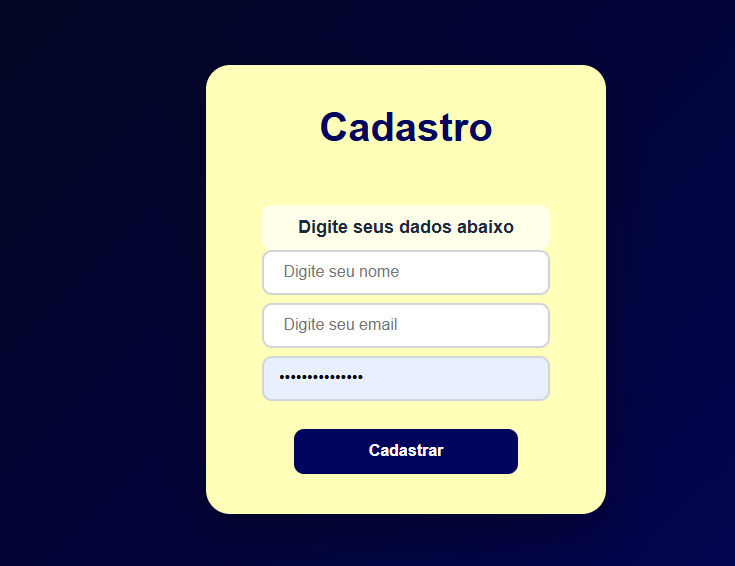

# 📝 Tela de Cadastro

Interface de cadastro desenvolvida com **HTML, CSS e JavaScript**, com validação dos dados preenchidos pelo usuário.

## 📸 Preview

## 🛠️ Tecnologias

- HTML5
- CSS3
- JavaScript

## ✨ Funcionalidades

- 🧑 Campo para nome
- 📧 Campo para e-mail
- 🔒 Campo para senha
- ✅ Validação dos dados preenchidos
- ⚠️ Verificação de campos inválidos ou vazios

## 🎯 Objetivo

Projeto desenvolvido para praticar:

- Estruturação de formulários HTML
- Estilização com CSS
- Flexbox
- Manipulação do DOM
- Validação de dados com JavaScript
- Interação com o usuário

---

💻 Desenvolvido por **Beymar**
